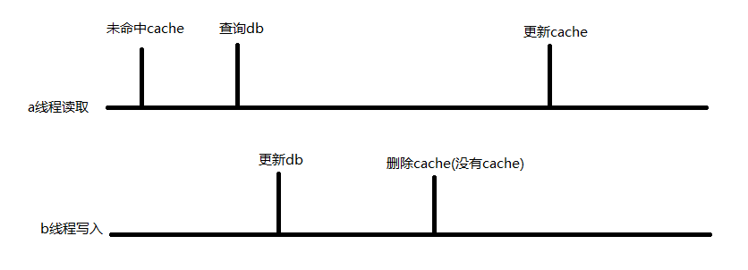

## 用redis实现一个定时任务
要实现定时任务就需要时间到了, 通知程序处理任务. redis的发布订阅可以实现server通知cli(SUBSCRIBE:发布, PSUBSCRIBE:订阅, PUBLISH:推送消息)
redis自带一些频道可以订阅, 叫做键空间通知. 他的作用是把redis数据的一些变动推送给客户端
具体实现方式是: cli订阅 __keyevent@0__:expired 频道, 需要处理定时任务就set一个key(key中可以附带一些业务数据),设置过期时间. 这个key生效时会在刚才的频道发布消息, 订阅的cli可以收到消息去处理对应任务 

## redis使用的时候遇到过哪些问题, 怎么解决的. 如果没遇到过问题, 有没有脑补过什么问题, 如果没脑补过, 那你回去等下消息
### 缓存雪崩
- 原因: 缓存突然失效或者redis服务挂了不可用, 大量的请求查询数据库导致数据崩了 
- 解决方法
1. key的过期时间随机, 防止出现大量的key在同一时间失效的情况 
2. 热点数据设置长时间或永久不过期, 或者把一个热点key转成多个key, 如果其中的一个失效或因为节点挂了不能访问, 就从别的key获取 
3. 业务上一些访问量高的场景, 对于缓存失效要有兜底策略, 避免影响到数据库 比如:服务降级(高负载的情况下直接返回)
4. 多级缓存 //todo, 
5. 互斥锁, 缓存不存在, 争抢到锁之后才可以去查询数据库, 更新缓存(会造成处理能力下降)
6. redis高可用 (//todo 单独整理)
### 缓存击穿
- 原因: 热点key失效, 和雪崩有点类似
- 解决方法: 基本和雪崩的解决方法类似, 不多bb
### 缓存穿透
- 原因不断请求不存在的key, 造成大量请求数据库
- 解决方法:
1. 一个请求过来, 如果缓存和数据库都没有, 就在缓存把这个key set为null, 时间可以设置短一些
2. 设置空的缓存只能防住key不变的情况, 如果攻击者随机了id, 就需要前置一个过滤器, 比如布隆过滤器(redis自带位图, 布隆过滤器需要单独安装,//todo 单独整理). 初始化的时候, 把db的id写入到布隆过滤器, 后续数据的新增也写到过滤器, 请求过来先查看是id是否存在, 不存在直接返回
### 缓存和数据库不一致
- 缓存和数据库的不一致没有百分百解决的方法, 只能尽量减少. 延迟不敏感的业务, 不一致可以接受, 关键业务还是直接查db稳妥
- 缓存更新有一下几种策略(查询未命中cache就查db再刷新cache这一点都是一样的, 主要区别是更新时的操作):
1. 修改db -> 删除缓存
可能出现不一致的情况: 
2. 修改db -> 更新缓存
可能出现不一致的情况: 1.同策略1  2.两个更新的线程, 时间轴和上图中一样, 也会出现不一致
解决方法: 写完db, 回写cache的时候, 使用setnx, 如果cache已经被更新了, 就不去覆盖.
3. 删除缓存 -> 修改db
出现不一致的情况: 删除完cache,还没更新db, 别的查询线程过来查询了db, 把cache补上了
- 这几个策略没办法完全解决数据不一致, 但是第一个策略相对简单, 数据不一致的概率也低
- 如果想完全保证一致性, 需要引入两阶段提交之类的协议, 给系统引入了复杂度, 并不是很现实, 需要考虑是否值得投入感情
- 可以监听db的binlog -> 获取数据发生变更的id -> push到消息队列 -> 异步删除对应cache 这样来实现最终的数据一致
- 延迟双删, 这个是为了解决1,2策略的问题, 写完数据延迟一段时间删除数据, 如果期间读请求更新了脏数据到缓存就会被删掉, 不过fpm这么整不是很ok啊, 同步代码一把梭
- 上面这些策略都是基于:数据库高可用, 不是三天两头挂一下, redis高可用, 不是三天两头连不上. 如果要考虑redis, mysql宕机的情况, 那可能性就多了,随着可能性的增加, 头发也会一点点脱落

## 一名中年男子走进会议室, 一边为让你等了俩小时这件事道歉一边让你自我介绍顺便看着简历发现了精通redis的关键词但是因为最近老板的剥削没空背八股想不到刁难的方法这件事发愁, 挠着头他终于问了一句: 你们公司是怎么处理redis的大key的
- 我们网站宕机一天都没人管, 我还在redis里保存了一个实况足球.zip, 没事就下载下来玩一玩
- 下班了, 回去看1900的平津战役!